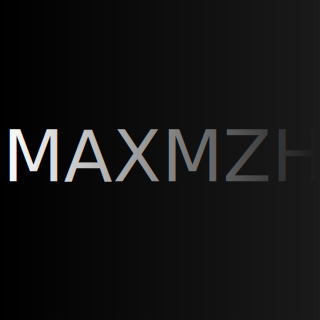

<!DOCTYPE html>
<html lang="en">
<head>
    <meta charset="UTF-8">
    <meta name="viewport" content="width=device-width, initial-scale=1.0">
    <title>MAXMZH - 主页</title>

    <link rel="icon" type="image/png" href="MAXMZH.png">

    <link rel="stylesheet" href="css/styles.css">
</head>
<body>
    <header>
        <nav>
            <ul>
                <li>主页</li>
                <li><a href="about.html">个人简介</a></li>
                <li><a href="portfolio.html">作品集</a></li>
<!--
                <li><a href="blog.html">博客</a></li>
-->
				<li><a href="contact.html">联系方式</a></li>
            </ul>
        </nav>
    </header>
    <main>
        <section class="hero">
            <h1>欢迎来到 MAXMZH 的个人主页</h1>
            
这里展示了我的个人简介、作品。

            
        </section>
    </main>
    <footer>
        
&copy; 2024 MAXMZH. 保留所有权利。

    </footer>
    
</body>
</html>
